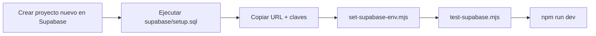

# Migración Supabase → Supabase

Guía para mover el proyecto a un Supabase nuevo (otra organización).
Como **no hay datos** en el proyecto actual, solo se recrea el esquema y se reapuntan las variables. No hace falta exportar/importar datos.

## Resumen



## Pasos

### 1. Crear el proyecto nuevo
En la nueva organización de Supabase: **New project**. Apunta la contraseña de la base de datos (no se usa aquí, pero guárdala).

### 2. Recrear el esquema (un solo paso)
En el proyecto nuevo: **SQL Editor** → **New query** → pega TODO el contenido de
[supabase/setup.sql](supabase/setup.sql) y pulsa **Run**.

Ese archivo crea, en una sola ejecución:
- Extensión `vector` (pgvector)
- Todas las tablas (`videos`, `video_analyses`, `chunks`, `strategy_profiles`, `chat_sessions`, `chat_messages`)
- Índices (incluido el HNSW para RAG)
- Triggers `updated_at`
- RLS y políticas por usuario
- RPC `match_chunks`
- Buckets de Storage (`trading-videos`, `chat-uploads`) y sus políticas
- Realtime activado en la tabla `videos`

Es idempotente: si lo ejecutas dos veces no pasa nada.

### 3. Copiar las credenciales nuevas
En el proyecto nuevo: **Project Settings** → **API**. Necesitas:
- **Project URL**
- **anon / publishable key**
- **service_role / secret key**

### 4. Reapuntar las variables (automático)
Desde la raíz del proyecto:

```bash
node scripts/set-supabase-env.mjs \
  --url https://NUEVO.supabase.co \
  --anon  <anon / publishable key> \
  --service <service_role / secret key>
```

Esto actualiza `web/.env.local` y `worker/.env` conservando `GEMINI_API_KEY`, `WORKER_SECRET` y los modelos.

### 5. Verificar
```bash
cd web && node scripts/test-supabase.mjs
```
Deberías ver todas las comprobaciones en verde (tablas, buckets, RPC, auth).

### 6. Arrancar
```bash
cd web && npm run dev
```

## Producción (cuando despliegues)
Si ya tienes Vercel/Railway desplegados, actualiza también allí las variables:
- **Vercel** → Settings → Environment Variables: `NEXT_PUBLIC_SUPABASE_URL`, `NEXT_PUBLIC_SUPABASE_ANON_KEY`, `SUPABASE_SERVICE_ROLE_KEY`
- **Railway** → Variables: `SUPABASE_URL`, `SUPABASE_SERVICE_ROLE_KEY`
- **Webhook**: en el Supabase nuevo, Database → Webhooks → recrea el webhook INSERT sobre `videos` apuntando a `https://tu-worker.railway.app/ingest` con el header `X-Worker-Secret`.

## Notas
- El proyecto viejo puedes pausarlo o borrarlo cuando confirmes que el nuevo funciona.
- Si habías creado usuarios de prueba, tendrás que volver a registrarlos en el proyecto nuevo (Auth no se migra con este método).
- Conviene rotar las claves del proyecto viejo si se compartieron.
